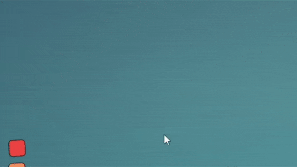

# Townscaper-TextureManager
 A Townscaper mod to change textures and palettes while in-game
 
# Features

- Change "Theme" or "Palette"

Note that if a "Palette" is associated with the selected "Theme" it will be updated too.

# Installation

1. Download "Melon Loader" by LavaGang:
https://github.com/LavaGang/MelonLoader/releases/latest/

2. Start the MelonLoader.Installer.exe

2.1. Click "Select" and navigate to your Townscaper folder and select the Townscaper.exe (usually: C:\Program Files(x86)\Steam\steamapps\common\Townscaper\Townscaper.exe)

2.2. :warning: Untick the "Latest" checkbox and choose **version 0.4.3** :warning:

2.3. Click install 

2.4. During the installation a "Mods" folder gets created it your game folder. MelonLoader does not(!) change any game files. 
	 You can uninstall anytime through the installer or by deleting the "version.dll" file.

3. Download the mod (latest release) by clicking [here](https://github.com/mokojm/Townscaper-TextureManager/releases/download/v0.8.0/TextureManager.zip)

4. Extract all the files from "TextureManager.zip" into your games Mods folder.

5. Download the utility mod "ModUI" (latest release) from: https://github.com/DigitalzombieTLD/TownscaperModUI/releases/latest/

6. Extract the all files from the ModUI download into your games Mods folder

7. Start the game !

8. The menu can be found here :

# Advanced feature

## Add textures or palette
Even so there are already a lot of Theme and Palette you might want to add your own. There might be an update for that option to be provided in-game but for now here is how to do it :
1. Locate your texture directory (usually "C:\Users\<Your_User_Name>\AppData\LocalLow\Oskar Stalberg\Townscaper\Textures")
2. Open "ModTextures" directory
3. If you want to add new textures (TownColor and/or TownMaterial) :
3.1. Create a new directory with the name you want your theme to have (ex : "Funky")
3.2. Inside that directory place your textures files "TownColor.png" and "TownMaterial.png".
3.3. If you have a "Palette" associated with your theme, follow step 4 but make sure the file name is the same with the directory created step 3.1
4. If you want to add a new Palette (TownPalette):
4.1. Open "Palettes" directory
4.2. Paste your "TownPalette" file inside and rename it (ex : "TownPalette.png" becomes "Funky.png")
5. If Townscaper was started, it needs to be restarted before enjoying your theme for the TextureManager mod. 

## Delete textures or palette
Let's say there are too many Theme or Palette, or you jerk off when one of them show up in-game. You can delete it by following the steps below.
1. Locate your texture directory (usually "C:\Users\<Your_User_Name>\AppData\LocalLow\Oskar Stalberg\Townscaper\Textures")
2. Open "ModTextures" directory
3. If you want to delete textures, you should delete the directory you want to disappear.
4. If you want to delete palettes, you should open "Palettes" directory and delete the one you want to disappear.

